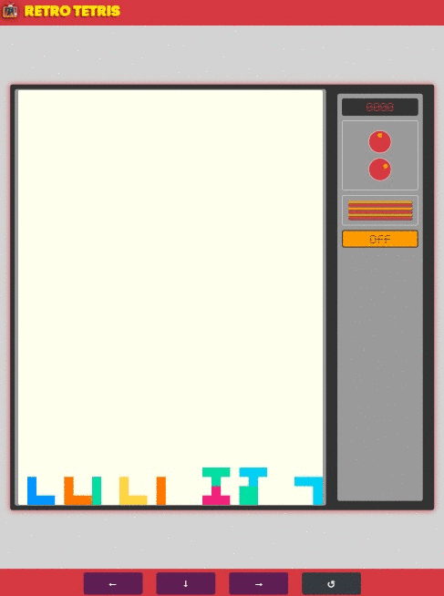

#  Tetris Demo

> This is a demo project to design a Tetris Game on Pure Javascript based on OOP.
 
 
 | Desktop Version | Mobile (On Going) | 
 | :---:         |     :---:      |  
 | |    |  
 | [Live Demo](https://esca-tetris-demo-f96ea.web.app/) | Enjoy It!🎉 |
   
## ⚡ Getting Started

There aren't many things to do before start working with this service. 
If you are used to work with javascript and webpack, just `Clone` 
this repo, `install` dependencies and `start` dev server or `build` the static version of page to easily be deploy on your own hosting. 

### 📦 Prerequisites

Now, we are going to describe each step exposed above to download and start you own local version of service.

##### *Clone Git Repository*
```Markdown
# Download Git Project
$ git clone https://github.com/escaLatamGit/TetrisDemo.git
``` 
##### *Install Node Dependencies*
```Markdown
# Run this command on project's root folder
# install dependencies
$ npm install
``` 

## 🎉 Usage   
There's no need to configure anything to run the application.
 If you correctly installed all project dependencies, you must 
 use `Development Server` to access to local version of this game, run `start` npm script
  to start a local server at port 8080 with hotreload version of page. Then, you would access to game
 in your browser at given URL (http://localhost:8080):
```Markdown
# Run this command on project's root folder
# start local dev server
$ npm run start
``` 

## 🚀 Deployment
Webpack allows us to make a compiled version of project to be uploaded/deployed
 on an instance of static server o just published on your preferred hosting service. 
 By default, distribution files are generated on `$root/dist`   with all requirements of the application. 
 To generate application bundle, just run npm `build` script. 
```Markdown
# Run this command on project's root folder
# Generate static version of the game
$ npm run build
``` 

## 🎨 Customization  

The Live Demo proposed in this project correspond 
to a basic implementation of Tetris Game Model, With that, 
you can customize game behavior based on your expectations. 

### 🥚 Basics
Let's review some customization of game: 
```javascript
/* Constructor Options */

import {TetrisGame} from "@model/tetris.game-model";  

const gameInstance = new TetrisGame(
                                  canvasSelector, /* CSS Selector of Canvas DOM Element */
                                  fps,  /* Refresh Rate of Canvas */
                                  canvasSize,  /* BoardSize instance with definition of Height/Width and Pixel Size  */
                                  colors,  /* HTML Color Array to use on Game Note: First value represents bg-color */
                                  acceleration  /*Acceleration rate of game  N px/sec^2 */
                                  );

/*
  Continue....
*/ 
``` 

```javascript
/* Customizing Canvas Size */

import {TetrisGame} from "@model/tetris.game-model";
import {BoardSize} from "@model/game.model";

const pixel = 10; // 10px;
const height = 10; // 10 pixel Unit -> 10 x 10px = 100px height;
const width = 10;  // 10 pixel Unit -> 10 x 10px = 100px width;

const canvasSize =  new BoardSize(height, width, pixel, pixel); 

const canvasSelector = "#game-canvas-id";
const fps = 50; // refresh rate/Frame Per Second;

const gameInstance = new TetrisGame(canvasSelector, fps, canvasSize);

/*
  Continue....
*/ 
``` 

```javascript

/* Customizing Piece Colors */

import {TetrisGame} from "@model/tetris.game-model";


const [ pixel, height, width, fps,canvasSelector ] = [ 10, 10, 10, 50, "#game-canvas-id" ];  

const backgroundColor = "#DBDCE8";
const piecesColor = [ "#7E4AD2", "#01ACF2", "#3DD3B0", "#FFE240", "#FE5670", "#F99D37" ];
const colorArray = [ backgroundColor, ...piecesColor ];
const gameInstance = new TetrisGame(canvasSelector, fps, new BoardSize(height, width, pixel, pixel), colorArray);

/*
  Continue....
*/ 
``` 

## ⚒ Contribution
Any suggestion or positive idea is welcome, there are many things to do. 
And how **Helen Keller** said 
>Alone we can do so little; together we can do so much.
#### Step 1
- **Fork or Clone this repository**
#### Step 2
- **Let's Do that** 🏗👷‍♀️
#### Step 3
- 🔃 Create a new pull request.

We are passionate of we do, and our commits too, let's use Commit Message Emoji 😎, to express intention of each commit. 
Inspired by [dannyfritz/commit-message-emoji](https://github.com/dannyfritz/commit-message-emoji)

## 🏗 Built With
* [Webpack](https://webpack.js.org/) - The static module bundler for modern JavaScript applications.
* [Babel js](https://babeljs.io/) - The javascript next generation compiler.
* [Bootstrap](https://getbootstrap.com/) - The world’s most popular front-end open source toolkit. 

## Authors

* **Carlos Esparragoza** - *Initial work* - [esca.latam](https://github.com/escaLatamGit)
  
